<p align="center">
  
</p>

<p align="center">
  <b>Turn a photograph into a Turing pattern, curate it with color, and solve the enigma hidden in the smoke.</b>
</p>

<p align="center">
  
  
  
  
  
  
</p>

---

**Vespera** is a local web application that runs a Gray-Scott reaction–diffusion simulation seeded by an image of your choice. The photograph dissolves, frame by frame, into labyrinths, spots or dewdrops. You can recolor the result with gradient palettes you design yourself, archive every pattern with its full lineage, and, if you are the person this project was made for, offer the right pattern at the altar to unseal **The Enigma**.

It was written in 32 days as a birthday gift and is built on one property: the simulation is deterministic. The same file with the same coefficients always produces the same pattern, bit for bit, and the same identifier, its *Cipher Rune*.

## Contents

- [Screenshots](#screenshots)
- [Features](#features)
- [How it works](#how-it-works)
- [Quick start](#quick-start)
- [Architecture](#architecture)
- [Project structure](#project-structure)
- [HTTP API](#http-api)
- [Configuration](#configuration)
- [Development](#development)
- [Known issues](#known-issues)
- [Roadmap](#roadmap)
- [Contributing](#contributing)
- [Documentation](#documentation)
- [Acknowledgements](#acknowledgements)
- [License](#license)

## Screenshots

<p align="center">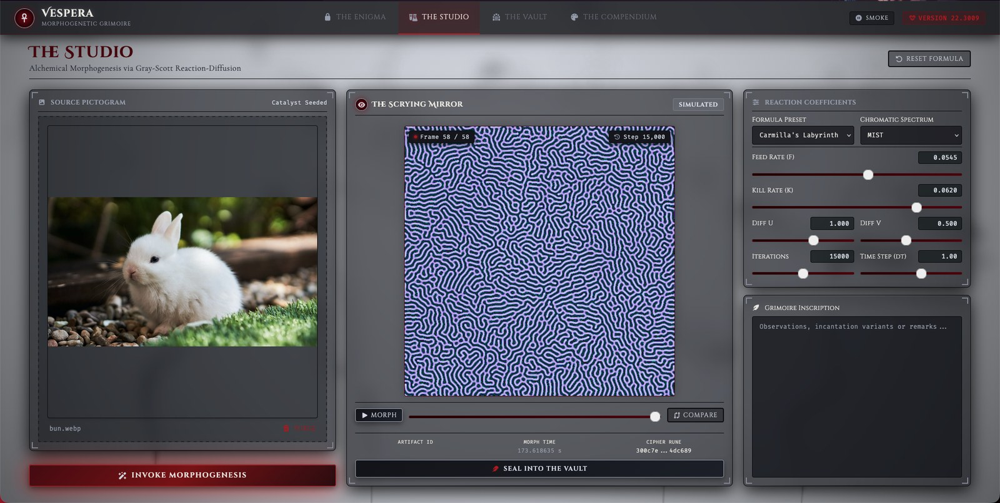</p>
<p align="center"><em>The Studio: a 15 000-step synthesis with Carmilla's Labyrinth, previewed in a user palette.</em></p>

| The Vault | The Compendium |
|:---:|:---:|
| 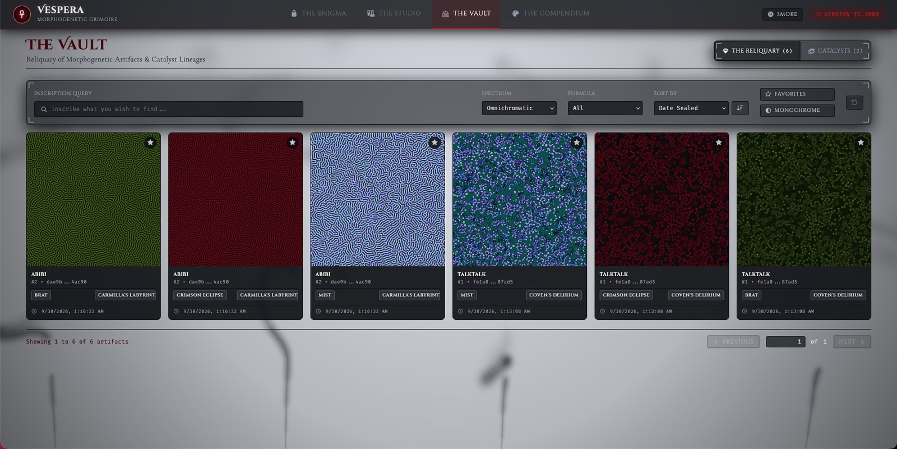 | 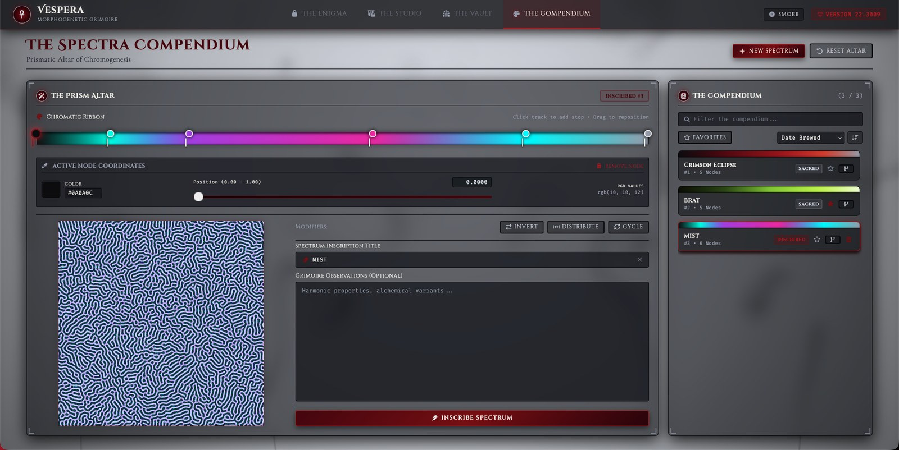 |

## Features

| Module | Route | What it does |
|---|---|---|
| **The Enigma** | `/enigma/22` | Shows a hint pattern, the formula that produced it and its *Target Rune*. Search your sealed artifacts, offer one at *The Altar of Offering*, and receive a SHA-512 *Secret Rune* and the link to *The Treasury* if it matches. |
| **The Studio** | `/studio/` | Load a *catalyst* image, pick a preset or tune every coefficient, *Invoke Morphogenesis*, watch about 58 keyframes play with any palette, compare with the enigma, and *Seal into The Vault*. |
| **The Vault** | `/vault/` | Gallery of *manifestations* (pattern × palette) with search, filters, sorting, favorites and a monochrome view; an inspector with playback and provenance; rename, notes, colored downloads, chained purges and *Branch Formula in The Studio*. A second tab manages the catalyst images. |
| **The Compendium** | `/spectra/compendium/` | Gradient editor with draggable stops, exact coordinates and *Invert*, *Distribute* and *Cycle* modifiers, live preview, and a catalog of palettes. The two system palettes, *Crimson Eclipse* and *BRAT*, can be branched but not changed. |
| Shell | every page | Animated smoke background with a persisted on/off toggle, alert and confirmation dialogs, loading overlay. Hold <kbd>Shift</kbd> and click **Smoke** for a surprise. |

<details>
<summary><b>Glossary of the interface</b></summary>

| Interface term | Meaning |
|---|---|
| Catalyst · Source Pictogram | The image that seeds a simulation |
| Formula · Reaction Coefficients | A Gray-Scott parameter set (F, k, Dᵤ, Dᵥ, Δt, N) |
| Artifact | A sealed simulation result (grayscale master, thumbnail, frames) |
| Spectrum | A gradient palette |
| Manifestation | One artifact rendered with one palette |
| Seal · Purge · Branch | Save · delete · derive a new version |
| Cipher Rune | SHA-256 identifier of an artifact |
| Target Rune · Secret Rune | The rune the enigma expects · the SHA-512 proof of solution |
| Sacred · Inscribed | System record (read-only) · user record |

</details>

## How it works

### The Gray-Scott model

Two virtual chemicals share a grid. The substrate $u$ is fed in and diffuses quickly; the activator $v$ consumes it to reproduce and diffuses half as fast. That asymmetry is enough to make patterns emerge from almost nothing:

```math
\frac{\partial u}{\partial t} = D_u \nabla^2 u - u v^2 + F(1 - u)
\qquad
\frac{\partial v}{\partial t} = D_v \nabla^2 v + u v^2 - (F + k)\,v
```

Vespera integrates the equations on a 1 024 × 1 024 torus with explicit Euler steps ($\Delta t = 1$) and a 3 × 3 Laplacian kernel (weights 0.05 · 0.20 · 0.05 / 0.20 · −1 · 0.20 / 0.05 · 0.20 · 0.05), clipping both fields to $[0, 1]$ after every step. With these weights the scheme is stable while $\Delta t \cdot D \le 1.25$.

### Seeding from a photograph

The image is converted to luminance $\ell \in [0, 1]$, which shapes the initial state and gently modulates the feed rate. The noise $\varepsilon \sim U(0, 0.08)$ comes from a generator with the fixed seed `20043009`, so the whole computation is a pure function of the file and the coefficients:

```math
v_0 = 0.35\,\ell + \varepsilon, \qquad u_0 = 1 - 0.30\,\ell, \qquad F(x, y) = F\,(0.95 + 0.10\,\ell)
```

<p align="center">
  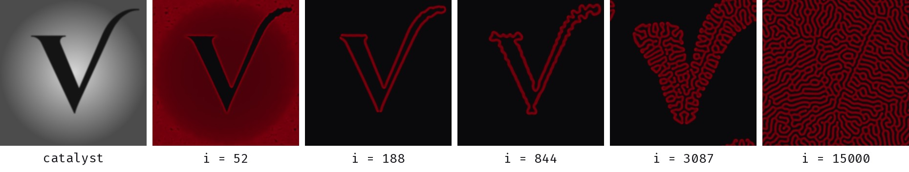<br>
  <sub>Carmilla's Labyrinth growing from a synthetic catalyst, rendered with the release code (512² grid, Crimson Eclipse).</sub>
</p>

### Presets

| Preset | F | k | Iterations | Pattern |
|---|---:|---:|---:|---|
| Carmilla's Labyrinth | 0.0545 | 0.0620 | 15 000 | Labyrinths (Karl Sims' “coral growth”) |
| Coven's Delirium | 0.0180 | 0.0510 | 12 000 | Chaotic spots and worms |
| Arterial Dewdrops | 0.0300 | 0.0630 | 24 000 | Hexagonal dots |

<p align="center">
  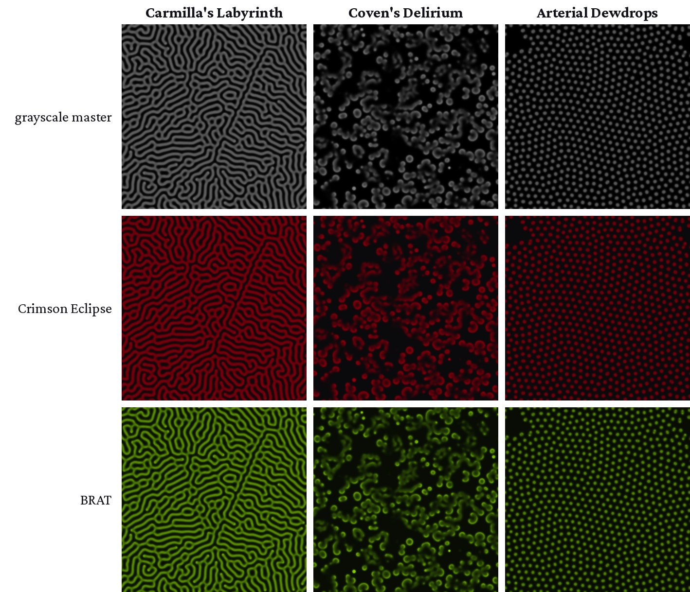
</p>

### Color without re-simulating

Every artifact is stored once, in grayscale. A palette is a list of stops that becomes a 256-entry look-up table by linear interpolation, and coloring a pattern is a single indexing operation, so switching palettes is instant. The browser does it on a canvas for previews, and the server does it with NumPy for downloads.

### Runes

```text
params_hash   = SHA-256("F:%.6f|k:%.6f|Du:%.6f|Dv:%.6f|dt:%.6f|iter:%d")
artifact_hash = SHA-256("IMG:" + SHA-256(file) + "|PAR:" + params_hash + "|SEED:20043009")   # Cipher Rune
secret_rune   = SHA-512("IMG:" + SHA-256(file) + "|QUEST:CUM22")                             # Secret Rune
```

The enigma is solved when the offered artifact's Cipher Rune equals the Target Rune. Re-saving, cropping or recompressing the photograph changes its bytes and therefore its rune: only the original file works.

## Quick start

**Requirements:** Python 3.14.3 or later, git, a modern browser (developed and tested on Firefox) and an internet connection for fonts, icons and Tailwind.

```bash
git clone https://github.com/NovaNecros/Vespera.git
cd Vespera
python3.14 -m venv venv
source venv/bin/activate          # Windows: venv\Scripts\activate
pip install -r requirements.txt
python3.14 run.py
```

Then open **<http://localhost:3009>**. The first start creates `data/vespera.db` and seeds the system palettes, the three presets and the enigma. A Carmilla's Labyrinth synthesis takes about three minutes on the author's machine; progress is shown in the terminal.

> [!NOTE]
> The server listens on all network interfaces (`0.0.0.0`) and has no authentication. Use it on a network you trust, or change `ServerSettings.HOST` to `127.0.0.1`.

## Architecture

Vespera is a modular monolith. A single Flask process serves Jinja2 page shells and a JSON API; each page is driven by a TypeScript controller that draws on Canvas 2D. The heavy simulation runs in Python with NumPy and SciPy; previews, playback and the smoke run in the browser.

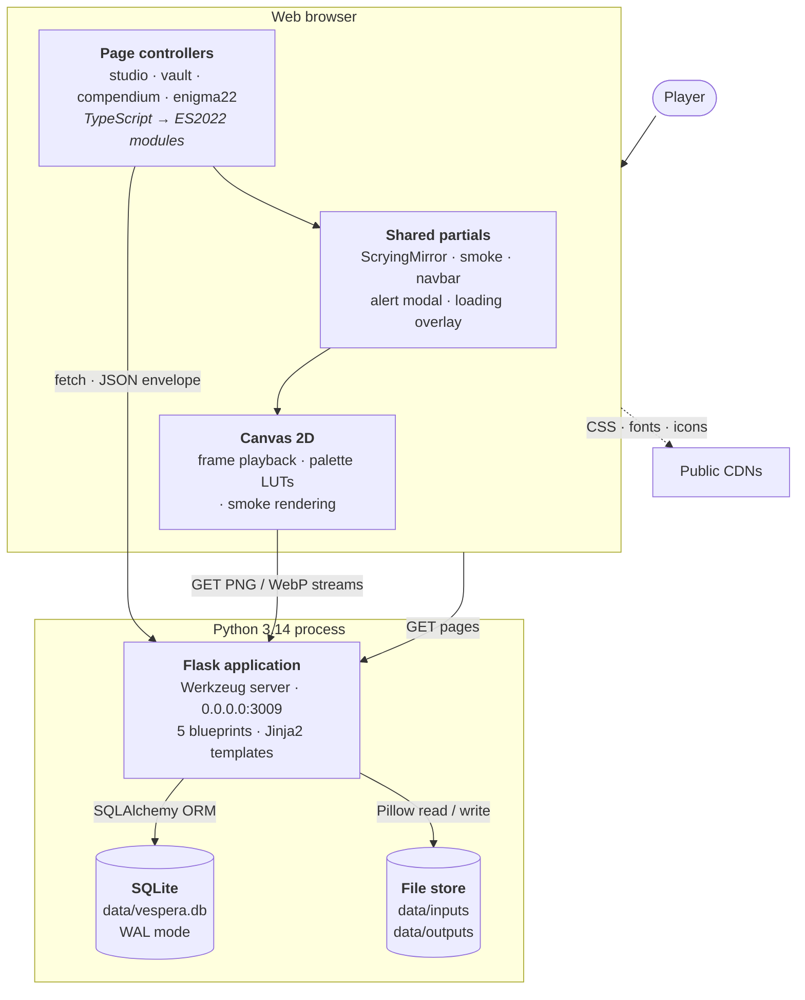

Inside the server, each blueprint calls one facade per module; facades delegate to application services, which use pure domain models (`TuringEngine`, `PaletteInterpolationModel`) and the infrastructure layer.

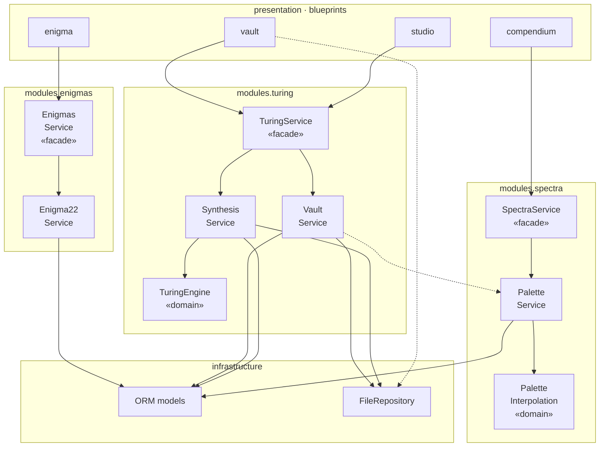

<details>
<summary><b>Data model</b> (8 tables)</summary>

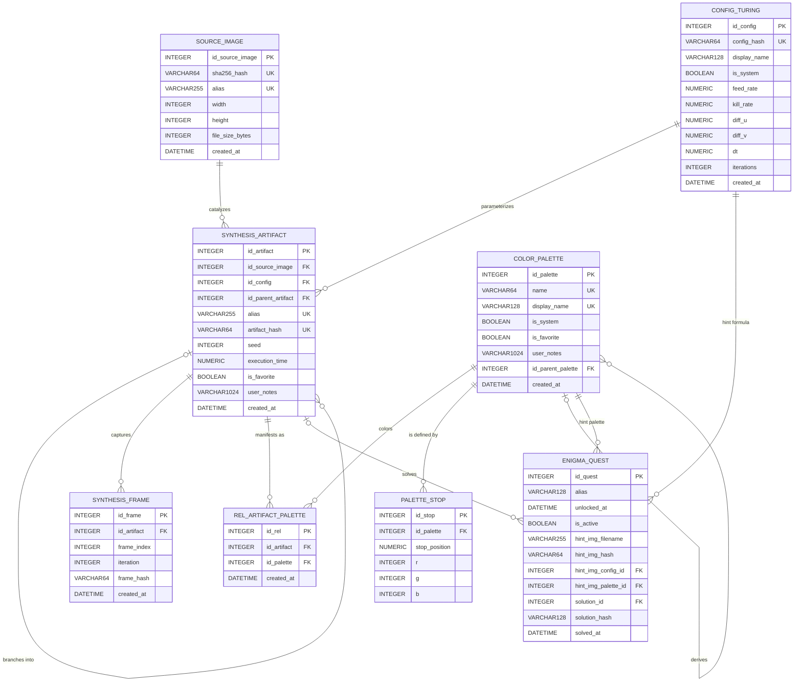

A crow's-foot version is in [`docs/assets/er-diagram.png`](docs/assets/er-diagram.png).

</details>

<details>
<summary><b>Synthesis sequence</b></summary>

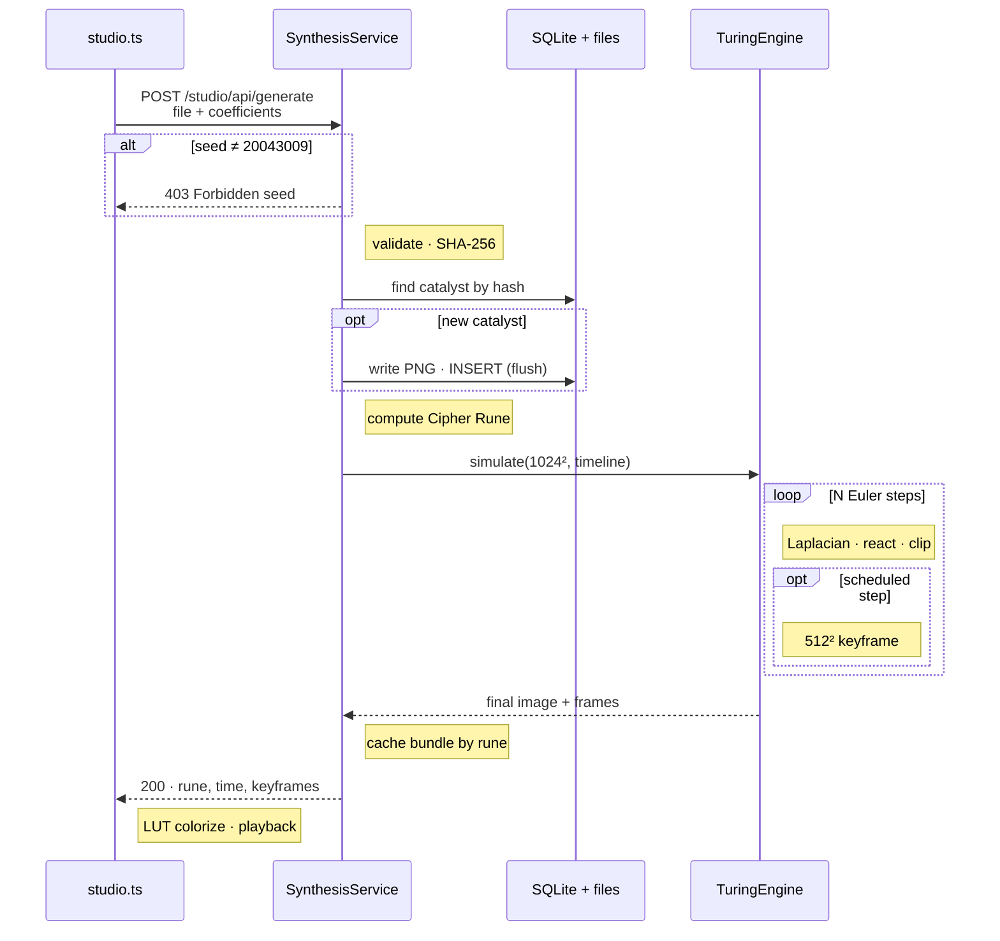

</details>

<details>
<summary><b>Offering an artifact to The Enigma</b></summary>

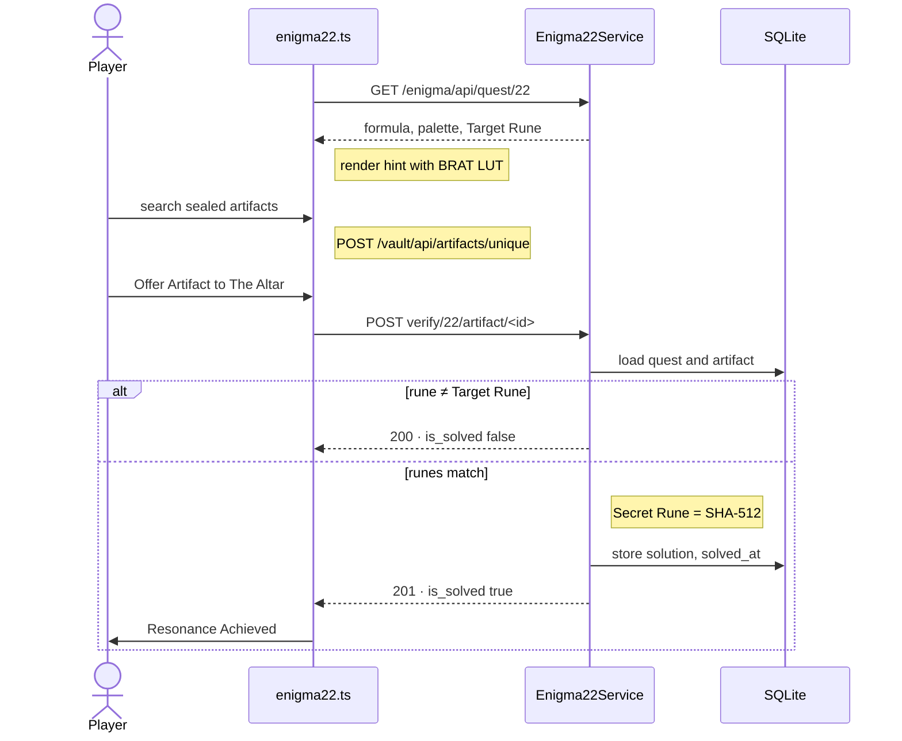

</details>

<details>
<summary><b>Artifact lifecycle</b></summary>

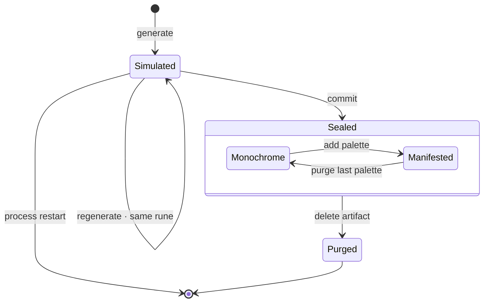

</details>

## Project structure

```text
Vespera/
├── run.py                     entry point: create_app() and app.run()
├── requirements.txt           pinned Python dependencies
├── tsconfig.json              TypeScript → app/presentation/static/js (ES2022, strict)
├── app/
│   ├── __init__.py            application factory, SQLite PRAGMAs, seeding, blueprints
│   ├── core/                  settings, SQLAlchemy instance, utilities, endpoint decorators
│   ├── infrastructure/        ORM models, content-addressed file repository, seed data
│   ├── modules/
│   │   ├── turing/            TuringService · SynthesisService · VaultService · TuringEngine
│   │   ├── spectra/           SpectraService · PaletteService · PaletteInterpolationModel
│   │   └── enigmas/           EnigmasService · Enigma22Service
│   └── presentation/
│       ├── routes/            home, studio, vault, compendium and enigma blueprints
│       ├── templates/         base.html, partials/ and one folder per page
│       └── static/            css/, ts/ (sources) and js/ (compiled, committed)
└── data/
    ├── inputs/                original_<sha256>.png                        (git-ignored)
    │   └── enigmas/           enigma22.png, the puzzle hint                (committed)
    ├── outputs/               turing_<rune>.png · thumbnails/ · frames/    (git-ignored)
    └── vespera.db             created on first run                         (git-ignored)
```

## HTTP API

Every JSON response uses the same envelope: `{"success": true, "status_code": 200, "data": …, "message": …}` on success and `{"success": false, "status_code": 4xx, "error": "…"}` on failure.

<details>
<summary><b>All 31 endpoints</b></summary>

| Method | Path | Purpose |
|---|---|---|
| GET | `/studio/api/turing/configs/system` | System formulas |
| POST | `/studio/api/generate` | Run a synthesis (multipart: `file` + coefficients) |
| POST | `/studio/api/commit` | Seal a synthesized artifact |
| POST | `/vault/api/gallery` | Paginated manifestations with filters and sorting |
| GET · POST | `/vault/api/artifacts/unique` | Search artifacts by alias or rune |
| GET | `/vault/api/artifact/<id>` | Artifact detail, children and manifestations |
| GET | `/vault/api/hydrate/artifact/<id>` | Bundle to load an artifact into the Studio |
| POST | `/vault/api/relationship/artifact/<id>/palette/<pid>` | Add a manifestation |
| POST | `/vault/api/alias/artifact/<id>` | Rename an artifact |
| POST | `/vault/api/toggle/favorite/artifact/<id>` | Toggle favorite |
| POST | `/vault/api/update/notes/artifact/<id>` | Edit notes |
| DELETE | `/vault/api/delete/relationship/<id_rel>` | Purge a manifestation |
| DELETE | `/vault/api/delete/artifact/<id>` | Purge an artifact (no manifestations left) |
| POST | `/vault/api/sources` | Paginated catalysts with artifact counts |
| GET | `/vault/api/cript` | Catalysts without artifacts |
| POST | `/vault/api/alias/source/<id>` | Rename a catalyst |
| DELETE | `/vault/api/cript/delete/source/<id>` | Purge a catalyst (no artifacts left) |
| GET | `/vault/api/download/relationship/<id_rel>` | Download a colored PNG |
| GET | `/vault/api/stream/artifact/hash/<rune>` | Grayscale master (PNG) |
| GET | `/vault/api/stream/thumbnail/hash/<rune>` | Thumbnail (PNG) |
| GET | `/vault/api/stream/source/hash/<sha256>` | Catalyst (PNG) |
| GET | `/vault/api/stream/artifact/hash/<rune>/frame/<i>` | Keyframe (WebP) |
| GET | `/spectra/compendium/api/palettes` | All palettes |
| GET | `/spectra/compendium/api/palette/name/<name>` | Palette by slug |
| POST | `/spectra/compendium/api/create/palette` | Create a palette |
| POST | `/spectra/compendium/api/update/palette/<id>` | Update a palette |
| POST | `/spectra/compendium/api/toggle/favorite/palette/<id>` | Toggle favorite |
| DELETE | `/spectra/compendium/api/delete/palette/<id>` | Delete a palette |
| GET | `/enigma/api/quest/22` | The CUM22 quest and its state |
| POST | `/enigma/api/verify/22/artifact/<id>` | Offer an artifact |
| GET | `/enigma/api/stream/hint/22` | Hint pattern (PNG) |

</details>

## Configuration

Settings are class attributes in [`app/core/config.py`](app/core/config.py).

| Setting | Default | Meaning |
|---|---|---|
| `ServerSettings.HOST` / `PORT` | `0.0.0.0` / `3009` | Bind address and port |
| `ServerSettings.DEBUG` | `False` | Flask debug mode |
| `ServerSettings.MAX_CONTENT_LENGTH` | 256 MB | Upload limit |
| `DBSettings.DB_PATH` | `data/vespera.db` | SQLite file |
| `RNGSettings.SEED` | `20043009` | Simulation seed (any other is rejected) |
| `TuringSettings.DEFAULT_WIDTH` / `HEIGHT` | `1024` | Simulation grid |
| `TuringSettings.DEFAULT_FRAMES` / `FRAME_DENSITY_EXP` | `60` / `3.2` | Keyframe schedule |

To start over, stop the server and delete `data/vespera.db*`, `data/outputs` and the `original_*.png` files in `data/inputs/`. Keep `data/inputs/enigmas/enigma22.png`.

## Development

Python code is fully type-hinted; TypeScript is compiled with `strict` and `noImplicitAny`. The compiled JavaScript is committed, so Node.js is only needed when you change the front end:

```bash
npm install -g typescript
tsc            # or: tsc --watch
```

Conventions used throughout the code base:

- Every file starts with a comment giving its path in the repository.
- Services return the response envelope as a dictionary instead of raising; decorators in `app/core/utils/decorators.py` turn it into JSON.
- The front end never hard-codes routes: templates inject them into `data-*` attributes with `url_for`, and controllers read them.
- Every request goes through `apiFetch<T>()`; shared types live in `static/ts/types.ts`.

There is no automated test suite yet. A proposed `pytest` plan is in the [technical reference](#documentation).

## Known issues

These were found while verifying the release for the technical reference. See its chapter 15 for evidence and suggested fixes. KI-02 (reverse-order seals could link an artifact to the wrong catalyst) and KI-08 (uploaded photographs were not git-ignored) have since been fixed.

| ID | Issue |
|---|---|
| KI-01 | The Vault's formula filter is ignored (`id_cofig` typo in `vault_service.py`). |
| KI-03 | A duplicate palette name returns 500 instead of 409. |
| KI-04 | A missing streamed file returns 500 instead of 404. |
| KI-05 | Deleting a palette silently deletes its manifestations. |
| KI-06 | Unsealed results stay in memory until the server restarts. |
| KI-07 | The server is reachable from the local network without authentication. |
| KI-09 | Dates are stored as naive UTC and shown as local time. |

## Roadmap

- [x] Fix KI-02 (catalyst lookup at seal time) and KI-08 (`original_*` in `.gitignore`)
- [ ] Fix the remaining known issues, starting with KI-01, KI-05 and KI-07
- [ ] Add a `pytest` suite and a CI workflow
- [ ] More presets from Pearson's (F, k) map
- [ ] More palette modifiers (random, partial shifts)
- [ ] Run syntheses in a background worker with progress reporting
- [ ] Bundle Tailwind, fonts and icons for offline use

## Contributing

Collaborators are welcome. Create a branch from `main`, keep to the conventions above, regenerate the JavaScript if you touch TypeScript, and open a pull request that explains what changed and why. Commit messages in the history are written in Spanish; either language is fine.

## Documentation

- **Technical reference** (`docs/Vespera_Technical_Reference.docx`): requirements, architecture (C4), class, ER, sequence and state diagrams, data dictionary, algorithms and numerical stability, full API specification, UI design system, security and privacy, performance, operations, verification results, known issues and project history.
- **User guide** (Spanish): the original guide that accompanied the gift.

## Acknowledgements

- A. M. Turing, *The Chemical Basis of Morphogenesis* (1952).
- P. Gray and S. K. Scott (1984) for the model; J. E. Pearson, *Complex Patterns in a Simple System* (1993), for its map of patterns.
- Karl Sims' [Reaction-Diffusion Tutorial](https://www.karlsims.com/rd.html) for the Laplacian weights and the coral-growth parameters.
- R. Bridson et al., *Curl-Noise for Procedural Fluid Flow* (2007), and S. Gustavson, *Simplex Noise Demystified* (2005), behind the smoke.
- Cinzel, Cinzel Decorative, Cormorant Garamond and Fira Code from Google Fonts; icons by Font Awesome.

## License

No license has been chosen yet, so all rights are reserved by the author. If you want others to reuse the code, add a `LICENSE` file.

<p align="center"><sub>Made with care in September 2026.</sub></p>
